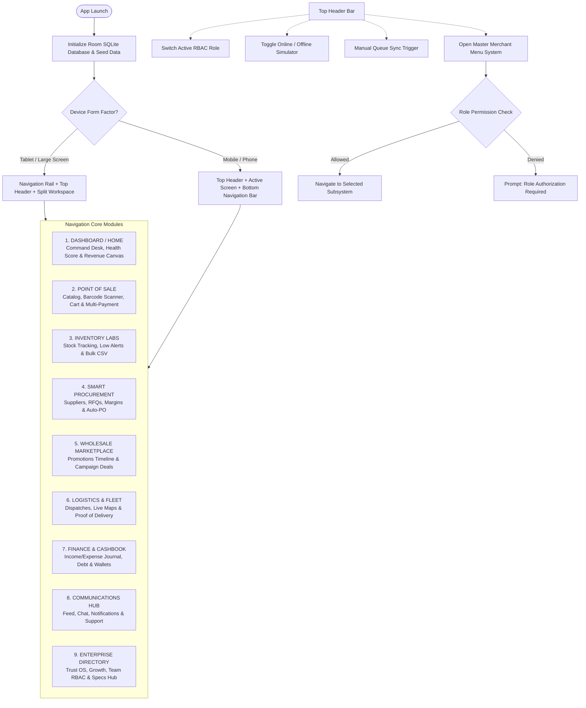
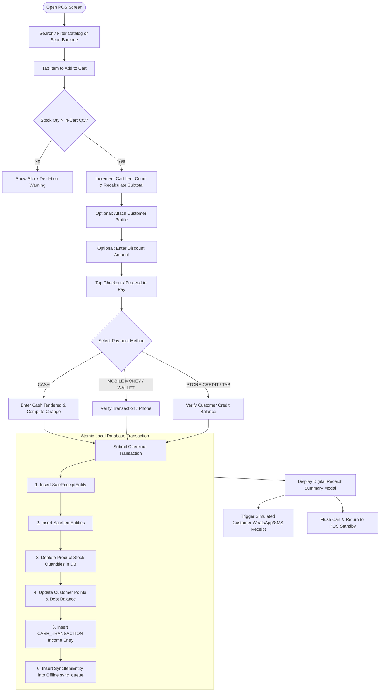
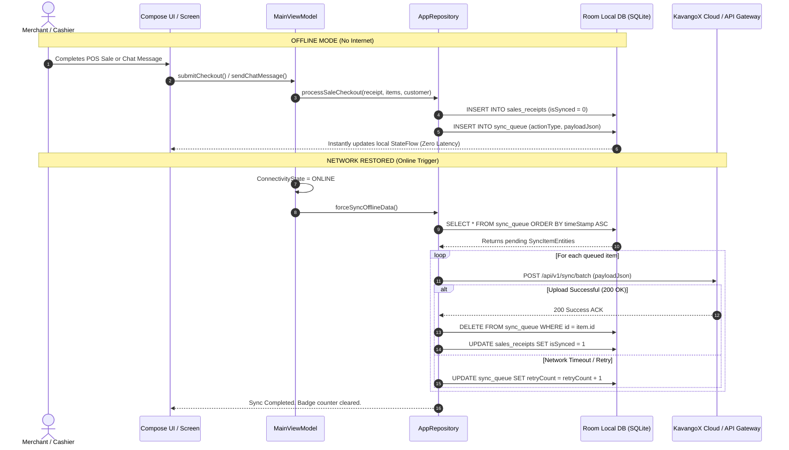
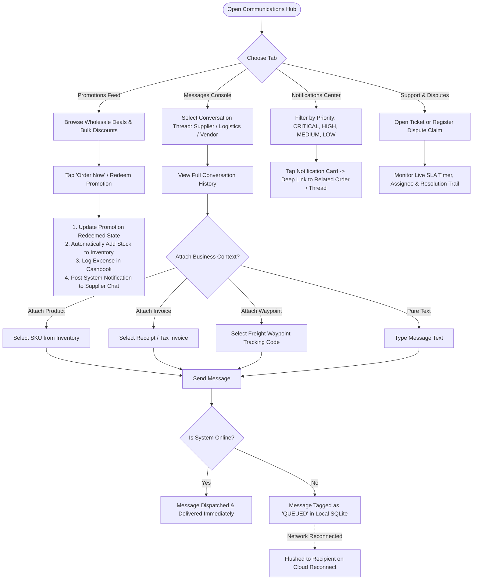

# KAVANGOX MERCHANT OS
## Business & Functional Requirements Document (BRD / FRD) & Architecture Audit

**Document Version:** 1.0.0  
**Project:** KavangoX Merchant OS (Commerce Operating System for Africa)  
**Target Platform:** Android (Jetpack Compose, Room SQLite, Offline-First Architecture, Material Design 3)  
**Date:** August 2026  

---

## 1. Executive Summary & Business Context

### 1.1 Problem Statement
Micro, Small, and Medium Enterprises (MSMEs) and informal retail merchants across Sub-Saharan Africa (Namibia, Angola, Zambia, South Africa, etc.) face critical operational hurdles:
- **Intermittent Connectivity:** Poor network coverage causes traditional cloud POS and ERP systems to freeze or drop transactions.
- **Fragmented Operations:** POS, inventory management, supplier reordering, informal customer credit/tabs, logistics tracking, and financial ledgers operate in separate silos or on paper.
- **Supplier & Working Capital Bottlenecks:** Lack of digitized sales history blocks access to trade credit, formal lending, and bulk discount procurement.
- **Multi-Role Coordination:** Shop owners, cashiers, store managers, logistics drivers, and warehouse staff lack unified, role-gated interfaces.

### 1.2 Solution: KavangoX Merchant OS
**KavangoX Merchant OS** is an offline-first commercial operating system designed for African retailers, informal tuck shops ("spaza" / "kiosks"), and FMCG distributors. It unifies:
1. **Offline POS & Multi-Payment Billing:** Instant checkout with cash, mobile money, cards, store credit tabs, and barcode scanning.
2. **Real-Time FIFO Inventory Labs:** Stock valuation, batch tracking, automatic minimum threshold alerts, and CSV bulk import.
3. **Smart Regional Procurement & Wholesale Marketplace:** RFQ management, supplier comparison, promotional bulk deal redemption, and automated purchase orders.
4. **Logistics & Dispatch Operations:** Route tracking, proof of delivery (POD) capture, and driver management.
5. **Double-Entry Cashbook & Digital Wallets:** Income/expense logging, P&L reporting, customer debt registers, and credit scoring.
6. **Communications & Support Hub:** Multi-party real-time chat, context linking (product, invoice, tracking), push/SMS/email notifications, and dispute resolution.
7. **Embedded AI Business Advisor (Gemini 3.5 Flash):** Context-injected AI consultant for inventory optimization, margin analysis, and turnover strategy.
8. **Adaptive 9-Tier Role-Based Access Control (RBAC):** Dynamic security matrix spanning Owners, Managers, Cashiers, Drivers, and Executives.

---

## 2. Codebase Audit & System State Analysis

### 2.1 Architecture Stack
| Layer | Technology | Status / Implementation Details |
| :--- | :--- | :--- |
| **UI Framework** | Jetpack Compose (Material 3) | Declarative UI, dynamic phone & tablet dual-pane layouts, responsive canvas charts |
| **Architecture Pattern** | MVVM + Repository Pattern | Clean separation between Compose UI, `MainViewModel`, `AppRepository`, and DAOs |
| **Local Persistence** | Android Room ORM (SQLite) | 6 relational entities with indexed primary keys, reactive `Flow<List<T>>` streams |
| **Offline Sync Engine** | `sync_queue` + Coroutines | Local-first write strategy with background sync worker, offline message queue, and retry policies |
| **AI Integration** | Google Gemini 3.5-Flash REST API | Context-injected prompt pipeline with real-time stock and sales data feeds |
| **Networking** | OkHttp3 / Coroutines | Asynchronous REST operations with timeout handling and network connectivity simulation |

### 2.2 Security & Permissions (RBAC)
The application defines 9 distinct enterprise roles:
1. **Merchant Owner / Owner:** Unrestricted access to all modules, financial journals, staff rosters, and settings.
2. **Executive:** Strategic oversight, finance, analytics, trust scores, growth center, and developer hubs.
3. **Enterprise Administrator:** Team rosters, system settings, RBAC definitions, MFA, and trust verification.
4. **Store Manager:** Day-to-day operations, POS, inventory, procurement, marketplace, logistics, and staff coordination.
5. **Sales Clerk / Cashier:** Front-of-house POS billing, quick sales, customer registry, and basic comms.
6. **Procurement Officer:** Inventory labs, supplier RFQs, marketplace promotions, and purchase orders.
7. **Warehouse Manager / Inventory Clerk:** Stock reconciliation, barcode cataloging, incoming freight, and dispatch.
8. **Driver:** Logistics delivery routes, live GPS viewfinders, and Proof of Delivery (POD) signature capture.
9. **Finance Officer:** Cashbook journals, expense tracking, credit limits, KYB verification, and P&L statements.

---

## 3. Entity Relationship Diagram (ERD)

```mermaid
erDiagram
    PRODUCT ||--o{ SALE_ITEM : "ordered in"
    SALES_RECEIPT ||--|{ SALE_ITEM : "contains"
    CUSTOMER ||--o{ SALES_RECEIPT : "makes"
    CUSTOMER ||--o{ CHAT_THREAD : "participates in"
    SALES_RECEIPT ||--o{ CASH_TRANSACTION : "generates income"
    SALES_RECEIPT ||--o{ DISPUTE_ITEM : "can be subject of"
    SALES_RECEIPT ||--o{ SYNC_QUEUE : "queued when offline"

    PRODUCT {
        string id PK "UUID / Product Code"
        string barcode "Indexed, EAN-13 / UPC"
        string name "Product Title"
        string category "Grocery, Snacks, Beverage, etc."
        double costPrice "FIFO Purchase Cost"
        double sellPrice "Retail Selling Price"
        int stockQty "Current Available Balance"
        int minStockAlert "Reorder Threshold"
        long expiryTimeStamp "Expiry Date"
        string supplierId "FK Supplier Identifier"
        string imageUrl "Product Asset URI"
    }

    SALES_RECEIPT {
        string id PK "REC-XXXXX"
        string customerId FK "Optional Customer ID"
        string sellerName "Cashier / Staff Name"
        long timeStamp "Transaction Unix Epoch"
        string paymentMethod "CASH, WALLET, BANK_TRANSFER, MOBILE_MONEY, STORE_CREDIT"
        double totalAmount "Net Final Price"
        double discountAmount "Deducted Discount"
        boolean isSynced "Sync Status Flag (0/1)"
    }

    SALE_ITEM {
        long id PK "AutoIncrement"
        string receiptId FK "Reference to SALES_RECEIPT"
        string productId FK "Reference to PRODUCT"
        string productName "Snapshot of Product Name"
        int quantity "Units Sold"
        double unitPrice "Snapshot of Unit Price"
    }

    CUSTOMER {
        string id PK "c-XXXXX"
        string name "Full Name"
        string phone "Phone Number / MSISDN"
        int loyaltyPoints "Reward Points"
        double outstandingDebt "Store Tab / Negative Balance"
        string email "Customer Email Address"
    }

    CASH_TRANSACTION {
        string id PK "tx-XXXXX"
        string transactionType "INCOME or EXPENSE"
        string category "RETAIL_SALE, STOCK_PURCHASE, RENT, UTILITIES, SALARY, OTHER"
        double amount "Value in NAD / N$"
        string description "Journal Line Description"
        long timeStamp "Transaction Timestamp"
    }

    SYNC_QUEUE {
        long id PK "AutoIncrement"
        string actionType "SYNC_SALE, SYNC_STOCK_ADJUSTMENT, SYNC_NEW_CUSTOMER"
        string payloadJson "Serialized JSON Payload"
        int retryCount "Retry Attempt Counter"
        long timeStamp "Queue Creation Timestamp"
    }

    PROMOTION_ITEM {
        string id PK "prom-XXXX"
        string supplierName "Distributor / Supplier Name"
        string supplierLogo "Icon / Emoji"
        string category "Wholesale / Retail / Bulk"
        string campaignType "Flash Sales / Bulk Deals / Bundles"
        string location "Depot Node"
        string title "Deal Title"
        string description "Deal Terms & Scope"
        double originalPrice "Standard Wholesale Rate"
        double promoPrice "Discounted Deal Rate"
        string validityPeriod "Expiration Details"
        boolean isSaved "Bookmark Status"
        int engagementLikes "Engagement Counter"
        int engagementViews "Impression Counter"
        boolean isRedeemed "Redeemed State"
    }

    CHAT_THREAD {
        string id PK "thread-XXXX"
        string participantName "Party Name"
        string participantRole "Supplier, Logistics, Support, Vendor"
        string participantLogo "Avatar Identifier"
        string lastMessage "Snippet"
        string time "Last Active Time"
        int unreadCount "Badge Counter"
    }

    CHAT_MESSAGE {
        string id PK "UUID"
        string senderId "me or them"
        string messageText "Message Content"
        long timeStamp "Timestamp"
        boolean isRead "Read Receipt"
        string status "SENT or QUEUED"
        string linkedProduct "Embedded Product Context"
        string linkedReceipt "Embedded Receipt Context"
        string linkedDeliveryTracker "Embedded Waypoint Tracker"
    }

    SUPPORT_TICKET {
        string id PK "TCK-XXXX"
        string category "Order, Delivery, Payment, Technical"
        string subject "Ticket Header"
        string description "Incident Details"
        string status "Open, In Progress, Resolved, Closed"
        string priority "LOW, MEDIUM, HIGH, CRITICAL"
        string assignedAgent "Support Agent"
        string timeCreated "Creation Timestamp"
        int slaTimerMinutes "Remaining SLA"
    }

    DISPUTE_ITEM {
        string id PK "DSP-XXXX"
        string receiptId FK "Related Order ID"
        string category "Payment, Delivery Failure, Damage, Refund"
        string subject "Dispute Header"
        string description "Claim Notes"
        double amount "Disputed Amount"
        string status "Open, Under Review, Resolved"
        string proposedOutcome "Refund, Redelivery, Denial"
        string actualOutcome "Settlement Outcome"
    }
```

---

## 4. Application Flow & Navigation Architecture

### 4.1 Global Navigation System (Adaptive Phone & Tablet)

### 4.2 Point of Sale (POS) Checkout Flowchart

### 4.3 Offline-First Synchronization Architecture

### 4.4 Communications & Context-Driven Messaging Flow

---

## 5. Functional Requirements Specification

### Module 1: Dashboard & Business Command Desk
- **FR-1.1 Real-Time Revenue Aggregation:** Continuously aggregate daily, weekly, and total revenue from `sales_receipts`.
- **FR-1.2 Dynamic Canvas Analytics:** Custom Jetpack Compose Canvas chart plotting 7-day revenue progression without external charting dependencies.
- **FR-1.3 Business Health & Credit Readiness:** Real-time scoring calculation (Health score, KYB Trust index, pre-approved credit limits).
- **FR-1.4 Low-Stock Operational Banner:** Immediate visual alerts for products at or below `minStockAlert` with one-tap routing to Procurement.

### Module 2: Point of Sale (POS) & Checkout Engine
- **FR-2.1 Instant SKU Search & Category Filtering:** Instant search by name, barcode, and category tab.
- **FR-2.2 Barcode Scanning Simulator & XML API:** Built-in hardware scanner and interactive software barcode input.
- **FR-2.3 Multi-Method Tender Processing:** Support for Cash (with change calculation), Mobile Money, Digital Wallets, Bank Transfers, and Store Credit Tabs.
- **FR-2.4 Customer Loyalty & Debt Management:** Real-time loyalty points accumulation (1 point per N$10 spent) and tab debt tracking.
- **FR-2.5 Digital Receipt Generation:** Instant itemized receipt modal with printable layout and automated SMS/WhatsApp dispatch simulation.

### Module 3: Inventory Labs & Warehouse Tracking
- **FR-3.1 SKU Lifecycle Management:** Add, edit, adjust, and delete products with cost price (FIFO), selling price, current stock, and safety alert thresholds.
- **FR-3.2 Bulk CSV Stock Ingestion:** Full parser for bulk importing inventory items via comma-separated values.
- **FR-3.3 Automated Cashbook Hook:** Adding new inventory batches automatically logs a corresponding `STOCK_PURCHASE` expense entry in the financial ledger.

### Module 4: Smart Procurement & Wholesale Marketplace
- **FR-4.1 Regional Supplier Directory:** Verified directory of Namibian and Southern African FMCG distributors.
- **FR-4.2 Automated Purchase Orders (PO):** Approval of POs automatically updates inventory levels, logs ledger expenses, and dispatches simulated logistics dispatches.
- **FR-4.3 Interactive Promotional Feed:** Real-time feed of supplier campaigns (Bulk Deals, Flash Sales, Product Launches) with one-tap order fulfillment.

### Module 5: Logistics & Fleet Management
- **FR-5.1 Consignment Waypoint Tracking:** Live GPS viewfinder simulation tracking cargo movement between regional hubs (e.g., Walvis Bay $\rightarrow$ Windhoek $\rightarrow$ Rundu).
- **FR-5.2 Driver Roster & Assignment:** Active status and rating management for logistics personnel.
- **FR-5.3 Proof of Delivery (POD):** In-app signature capture to register cryptographic delivery verification.

### Module 6: Cashbook, Digital Wallets & Financial Intelligence
- **FR-6.1 Double-Entry Transaction Ledger:** Classification of income and expense transactions (`RETAIL_SALE`, `STOCK_PURCHASE`, `RENT`, `SALARY`, `UTILITIES`).
- **FR-6.2 P&L and Margin Calculation:** Real-time net profit and margin analysis comparing revenue against FIFO cost of goods sold.
- **FR-6.3 Customer Store Tab Ledger:** Positive/negative credit ledger tracking informal customer debt and repayments.

### Module 7: Communications, Notifications & Dispute Hub
- **FR-7.1 Multi-Threaded Business Chat:** In-app chat with suppliers, logistics partners, and support agents.
- **FR-7.2 Rich Context Linking:** Ability to embed active inventory SKUs, settled receipt invoices, and cargo tracking numbers directly inside chat messages.
- **FR-7.3 Multi-Channel Notifications:** Centralized notification center supporting In-App, SMS, and Email channels with priority tagging.
- **FR-7.4 Dispute Adjudication Board:** End-to-end handling of damaged cargo claims, refunds, and redelivery requests with audit trails.

### Module 8: Embedded AI Business Consultant (Gemini 3.5-Flash)
- **FR-8.1 Real-Time Business Data Context Injection:** Automatic prompt enrichment with live stock summaries, low-stock warnings, revenue totals, and customer debt.
- **FR-8.2 Regional Commercial Advice:** Actionable recommendations on pricing elasticity, high-margin bundles, fast-moving items, and stock replenishment.
- **FR-8.3 Graceful Offline Degradation:** Fallback messaging and offline handling when network or API keys are unavailable.

### Module 9: Role-Based Access Control (RBAC) & Enterprise Settings
- **FR-9.1 9-Tier Granular RBAC Matrix:** Strict module gating ensuring users only view and operate areas permitted by their designated role.
- **FR-9.2 Multi-Branch Configuration:** Multi-store switching, tax settings (Namibian VAT), and system specification audit tools.

---

## 6. Role-Based Access Control (RBAC) Matrix

| Module / Screen | Merchant Owner | Executive | Enterprise Admin | Store Manager | Sales Clerk / Cashier | Procurement Officer | Warehouse Manager | Driver | Finance Officer |
| :--- | :---: | :---: | :---: | :---: | :---: | :---: | :---: | :---: | :---: |
| **Command Desk (Home)** | Yes | Yes | Yes | Yes | Yes | Yes | Yes | Yes | Yes |
| **Point of Sale (POS)** | Yes | Yes | No | Yes | Yes | No | No | No | No |
| **Inventory Labs** | Yes | Yes | No | Yes | No | Yes | Yes | No | No |
| **Smart Procurement** | Yes | Yes | No | Yes | No | Yes | No | No | No |
| **Wholesale Marketplace**| Yes | No | No | Yes | No | Yes | No | No | No |
| **Logistics & Fleet** | Yes | No | No | Yes | No | No | Yes | Yes | No |
| **Finance & Cashbook** | Yes | Yes | No | No | No | No | No | No | Yes |
| **Communications Hub** | Yes | No | No | Yes | Yes | No | No | No | No |
| **Analytics Engine** | Yes | Yes | No | No | No | No | No | No | Yes |
| **Trust & Verification** | Yes | Yes | Yes | No | No | No | No | No | Yes |
| **Growth Center** | Yes | Yes | No | No | No | No | No | No | Yes |
| **Team Hub** | Yes | No | Yes | Yes | No | No | No | No | No |
| **System Settings** | Yes | No | Yes | No | No | No | No | No | No |
| **Intel / Dev Hub** | Yes | Yes | Yes | Yes | Yes | Yes | Yes | Yes | Yes |

---

## 7. Technical Verification & Architecture Compliance Checklist

- [x] **Room ORM Entity Mapping:** 100% compliant with SQLite indexing, foreign key logic, and reactive coroutine Flows.
- [x] **Zero External Charting Libraries:** High-performance Jetpack Compose Canvas implementations for finance and turnover trendlines.
- [x] **Strict Local Write Policy:** Local Room SQLite write executes before any sync queue insertions or network dispatch attempts.
- [x] **Rich Context Linking in Chat:** Cross-module entity linking (Product, Receipt, Tracker) fully implemented in Compose UI.
- [x] **Dual-Pane Adaptive Layout:** Dynamic switching between Navigation Rail (Tablet/Desktop) and Bottom Navigation Bar (Phone).
- [x] **Comprehensive Data Seeding:** Authentic initial Namibian retail dataset seeded automatically on fresh install.

---
*Document produced as part of the KavangoX Merchant OS Technical Architecture & Functional Review.*
