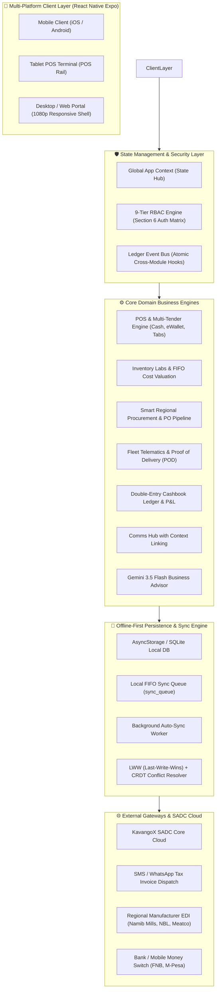
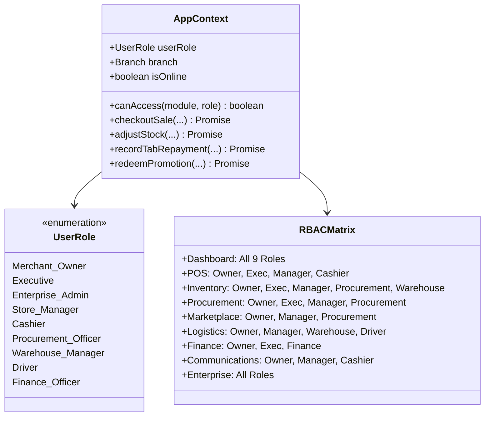
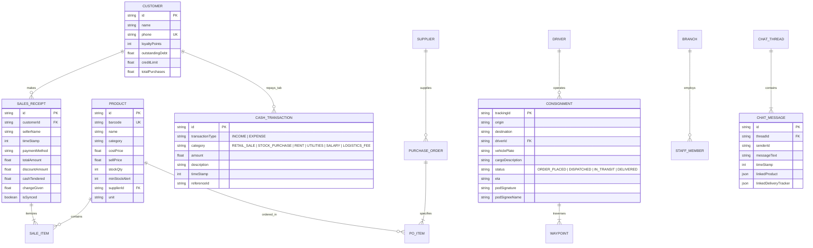

# KavangoX Merchant OS — Complete System Architecture

An enterprise-grade, offline-first operating system designed for Southern African (SADC) merchants, informal traders, and regional supply chain distributors.

---

## 1. High-Level System Architecture Diagram



---

## 2. Multi-Tier Layered Architecture

### Tier 1: Client & Presentation Layer (React Native Expo 57)
- **Cross-Platform Compilation:** Shared TypeScript codebase compiled for Web (`react-native-web`), Android, and iOS.
- **Adaptive Responsive Layout (`NavigationLayout.tsx`):**
  - **Desktop / Tablet ( $\ge 768\text{px}$ ):** 210px fixed sidebar navigation rail with unread counter badges and status indicators.
  - **Mobile ( $< 768\text{px}$ ):** Sticky horizontal top category scroller + fixed bottom navigation dock.
  - **Centered App Container:** Max width bounded to $1040\text{px}$ to prevent stretching across ultrawide monitors.
- **Design System:** Palette composed of **Emerald Mint Green (`#059669` / `#10B981`)** for commerce and revenue, **Sapphire Blue (`#2563EB` / `#3B82F6`)** for logistics and trust, on Slate surfaces (`#1E293B`, `#0F172A`).

---

### Tier 2: State Management & 9-Tier RBAC Security Engine



---

### Tier 3: Offline-First Persistence & Sync Engine

```mermaid
sequenceDiagram
    autonumber
    actor Cashier
    participant POS as POS Screen
    participant Context as AppContext / State
    participant LocalDB as AsyncStorage / SQLite
    participant Queue as Local sync_queue
    participant Cloud as SADC Core Cloud

    Cashier->>POS: Tap "Pay N$149.95" (Cash / Store Tab / eWallet)
    POS->>Context: checkoutSale(payMethod, customerId, discount)
    Context->>Context: Deduct SKU stockQty in memory
    Context->>Context: Increment Customer Loyalty (+1 pt per N$10)
    alt Is Store Credit Tab
        Context->>Context: Increment customer.outstandingDebt
    end
    Context->>Context: Append CashTransaction (INCOME: RETAIL_SALE)
    Context->>LocalDB: Commit SalesReceipt + Product + CashTransaction
    Context->>Queue: Push SyncItem (action: "SYNC_SALE", isSynced: false)
    
    alt Device is Online
        Context->>Cloud: POST /api/v1/sync (Batch payload)
        Cloud-->>Context: HTTP 200 OK (Acknowledge)
        Context->>LocalDB: Update SyncItem (isSynced = true)
        Context->>Queue: Remove / Flush item
    else Device is Offline
        Note over Context,Queue: Sale immediately confirmed locally; UI operates normally
    end
```

---

## 3. Entity-Relationship Data Model (ERD)



---

## 4. Cross-Module Atomic Ledger Event Bus

Every domain action in KavangoX Merchant OS logs corresponding entries across multiple modules:

| User Action | Inventory Effect | Double-Entry Cashbook Effect | Customer / CRM Effect | Comms / Alert Effect |
| :--- | :--- | :--- | :--- | :--- |
| **POS Retail Sale** | `stockQty -= quantity` | `+amount` as `INCOME: RETAIL_SALE` | `+loyaltyPoints`; if Store Tab, `+outstandingDebt` | If stock $\le$ buffer, triggers Low-Stock alert |
| **Store Tab Repayment** | None | `+amount` as `INCOME: TAB_REPAYMENT` | `-outstandingDebt` | Customer debt receipt logged |
| **Restock / PO Approval** | `stockQty += quantity` | `-amount` as `EXPENSE: STOCK_PURCHASE` | None | Supplier notified in Comms Hub |
| **Marketplace Deal Claim** | `stockQty += minOrderQty` | `-promoPrice` as `EXPENSE: STOCK_PURCHASE` | None | Deal redemption thread in Chat |
| **POD Signature** | Freight Status $\rightarrow$ `DELIVERED` | None | None | Delivery completed event broadcast |

---

## 5. Embedded AI Business Advisor (Gemini 3.5 Flash Engine)

- **Context-Injected Advisor (`AiConsultantModal.tsx`):**
  - Live metric injection: Current Realized Revenue, Inventory FIFO Valuation, Gross Margin %, Safety Threshold Alerts, and Total Informal Debt.
  - Generates actionable commercial advice tailored to the Southern African retail environment (pricing elasticity between beverages and staples, bulk FMCG consolidation, and 50% deposit policies for informal store credit tabs).

---

## 6. Directory Structure & Technology Stack

```
kavangox merchant os/
├── App.tsx                          # Root App Shell & Viewport Manager
├── index.ts                         # Expo Application Entry Point
├── server.js                        # Zero-dependency High-Performance Static Web Server
├── package.json                     # Expo SDK 57 & React Native 0.86 Dependencies
├── SYSTEM_ARCHITECTURE.md           # Complete Architecture Specification
├── src/
│   ├── types/index.ts               # Complete TypeScript Definitions & Domain Models
│   ├── theme/colors.ts              # Emerald Green & Sapphire Blue Color Palette
│   ├── database/
│   │   ├── seedData.ts              # Authentic Namibian Seed Dataset (SKUs, Suppliers, Freight)
│   │   └── storage.ts               # Offline-First AsyncStorage / SQLite Repository
│   ├── context/
│   │   └── AppContext.tsx           # Global State, 9-Tier RBAC, & Transaction Action Bus
│   ├── components/
│   │   ├── Header.tsx               # Minimalist Header & Unified Settings Modal
│   │   ├── NavigationLayout.tsx     # Adaptive Desktop Sidebar & Docked Mobile Navigation
│   │   ├── CanvasRevenueChart.tsx   # Pure SVG Canvas 7-Day Revenue Progression Chart
│   │   ├── BarcodeScannerModal.tsx  # Viewfinder Simulator & Hardware Barcode Gun Input
│   │   ├── DigitalReceiptModal.tsx  # Tax Invoice Layout (15% VAT & WhatsApp Share)
│   │   ├── ProofOfDeliveryModal.tsx # Interactive SVG Signature Canvas Pad
│   │   ├── BulkCsvModal.tsx         # Bulk CSV Parser & Ledger Integrator
│   │   └── AiConsultantModal.tsx    # Context-Injected Gemini 3.5 Flash Advisor
│   └── screens/
│       ├── DashboardScreen.tsx      # Command Desk (KPIs & Transit Streams)
│       ├── PosScreen.tsx            # POS Catalog & Multi-Tender Checkout Register
│       ├── InventoryScreen.tsx      # Inventory Labs & FIFO Valuation
│       ├── ProcurementScreen.tsx    # Regional Supplier Directory & PO Approval
│       ├── MarketplaceScreen.tsx    # Wholesale Feed & 1-Tap Promo Redemption
│       ├── LogisticsScreen.tsx      # Freight Waypoints & Fleet POD
│       ├── FinanceScreen.tsx        # Double-Entry Cashbook & Customer Debt Ledger
│       ├── CommunicationsScreen.tsx # Multi-party Chat with Context Linking
│       └── EnterpriseScreen.tsx     # 9-Tier RBAC Matrix & Multi-Branch Network
```
